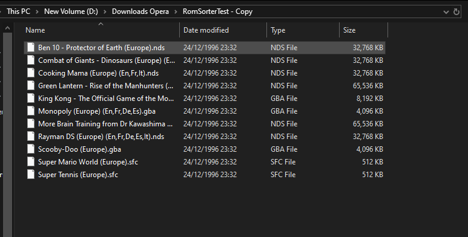
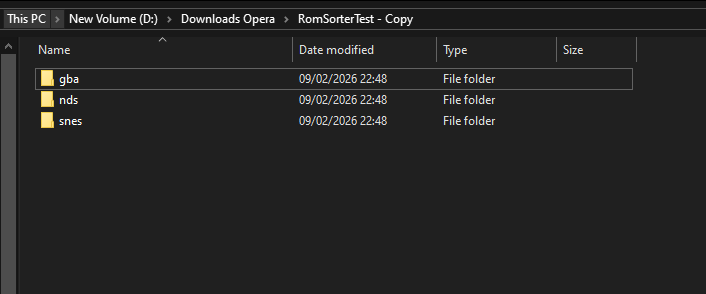

# RomSorter

This is a simple Java application that will sort your messy ROM folder into the their dedicated folder based on their file extension (their system). 
Any issues or wanted file extensions/systems please use the issues tab on the github page.

## Supported Systems
Many systems are supported but not all, especially disc-based systems, so it may not be perfect for you
and if there are any systems with unique extension names you would like to see added 
please use the github issues tab.

## Naming convention
The naming convention was purposefully chosen to be easily usable in common rom applications such as EmuDeck,
so you should be able drop your organised folders right into the roms folder and they will automatically go
exactly where they need to. 

Quickly and simply take your messy rom collection as show:

### Before Sorting

### After Sorting

